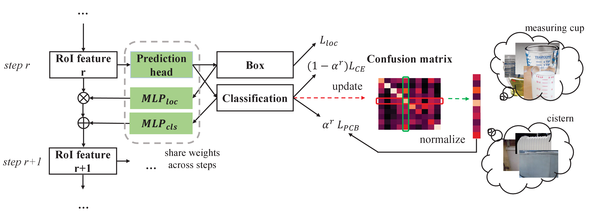

# Relieving Long-tailed Instance Segmentation via Pairwise Class Balance 

Official code for CVPR 2022 paper "Relieving Long-tailed Instance Segmentation via Pairwise Class Balance". The implementation is based on MMDetection (version 2.16.0).

**[Relieving Long-tailed Instance Segmentation via Pairwise Class Balance](https://arxiv.org/abs/2201.02784)**  
Yin-Yin He*, Peizhen Zhang*, Xiu-Shen Wei, Xiangyu Zhang, Jian Sun</br>
CVPR 2022

## Introduction

Long-tailed instance segmentation is a challenging task due to the extreme imbalance of training samples among classes. It causes severe biases of the head classes (with majority samples) against the tailed ones. This renders “how to appropriately define and alleviate the bias” one of the most important issues. Prior works mainly use label distribution or mean score information to indicate a coarse-grained bias. In this paper, we explore to excavate the confusion matrix, which carries the fine-grained misclassification details, to relieve the pairwise biases, generalizing the coarse one. To this end, we propose a novel Pairwise Class Balance (PCB) method, built upon a confusion matrix which is updated during training to accumulate the ongoing prediction preferences. PCB generates fightback soft labels for regularization during training. Besides, an iterative learning paradigm is developed to support a progressive and smooth regularization in such debiasing. PCB can be plugged and played to any existing method as a complement. Experimental results on LVIS demonstrate that our method achieves state-of-the-art performance without bells and whistles. Superior results across various architectures show the generalization ability.

### Framework of PCB


## Prerequisites
- python 3.7
- pytorch 1.9.0
- torchvision 0.10.0
- opencv 4.5.3
- [mmcv 1.3.12](https://github.com/open-mmlab/mmcv/tree/v1.3.12)

## Usage

### Installation

```bash
git clone https://github.com/megvii-research/PCB
cd PCB
pip install -r requirements/build.txt
pip install -v -e .  # or "python setup.py develop"
```

### Training

```bash
# ./tools/dist_train.sh ${CONFIG} ${GPU_NUM}
# the configs of PCB method are all stored in ./configs/pcb/
# In all our experiments, we enable FP16 to speedup a little
./tools/dist_train.sh ./configs/pcb/mask_rcnn_r50_fpn_sample1e-3_mstrain_pcb_2x_lvis_v0.5_fp16.py 8 --no-validate
```

### Evaluation
```bash
# ./tools/dist_test.sh ${CONFIG} ${CHECKPOINT} ${GPU_NUM} [--eval ${EVAL_METRICS}]
# The configs of PCB method are all stored in ./configs/pcb/
./tools/dist_test.sh configs/pcb/mask_rcnn_r50_fpn_sample1e-3_mstrain_pcb_2x_lvis_v0.5_fp16.py path/to/your/pretrained/checkpoint.pth 8 --eval bbox segm
```

## Main Experiments and Models
All experiments are based on Mask RCNN, and with multi-scale training. Seesaw is implemented with RFS.

### Experiments on LVIS v0.5


Backbone | Method | AP | APr | APc | APf | APb | config | pretrained model
--- |:---:|:---:|:---:|:---:|:---:|:---:|:---:|:---:|
R50-FPN | Softmax + PCB |25.1 | 12.6 | 25.5 | 29.5 | 25.2 | [config](configs/pcb/mask_rcnn_r50_fpn_mstrain_pcb_2x_lvis_v0.5_fp16.py) | [LINK](https://drive.google.com/file/d/1wyE0d_5qRcQw0z0PQctZM5CCee3aSniq/view?usp=sharing) |
R50-FPN | RFS + PCB | 27.7 | 21.8 | 28.0 | 29.7 | 28.2 | [config](configs/pcb/mask_rcnn_r50_fpn_sample1e-3_mstrain_pcb_2x_lvis_v0.5_fp16.py) | [LINK](https://drive.google.com/file/d/1C2EZprJ1ItbJ85yK72Ub9xRhPFWmW-U_/view?usp=sharing) |
R50-FPN | EQL v2 + PCB | 27.8 | 20.9 | 28.4 | 29.9 | 28.1 | [config](configs/pcb/mask_rcnn_r50_fpn_mstrain_eqlv2_pcb_2x_lvis_v0.5_fp16.py) | [LINK](https://drive.google.com/file/d/1vIfeA2C5896GJNZPSWkybKpOGgIVNs8K/view?usp=sharing) |
R50-FPN | Seesaw + PCB | 28.8 | 23.4 | 29.6 | 30.0 | 28.6 | [config](configs/pcb/mask_rcnn_r50_fpn_sample1e-3_seesaw_pcb_normed_mask_mstrain_2x_lvis_v0.5_fp16.py) | [LINK](https://drive.google.com/file/d/1b5Mji22wTvmrb__UWz7CUNU8iplZ2b4Z/view?usp=sharing) |

### Experiments on LVIS v1

Backbone | Method | AP | APr | APc | APf | APb | config | pretrained model
--- |:---:|:---:|:---:|:---:|:---:|:---:|:---:|:---:|
R50-FPN | Softmax + PCB | 22.6 | 7.7 | 21.8 | 29.9 | 24.1 | [config](configs/pcb/mask_rcnn_r50_fpn_mstrain_pcb_2x_lvis_v1_fp16.py) | [LINK](https://drive.google.com/file/d/11RKmRnzMdfkji4OhLCgFOLmaKeBCAShQ/view?usp=sharing) |
R50-FPN | RFS + PCB | 26.5 | 18.5 | 26.5 | 30.2 | 28.3 | [config](configs/pcb/mask_rcnn_r50_fpn_sample1e-3_mstrain_pcb_2x_lvis_v1_fp16.py) | [LINK](https://drive.google.com/file/d/1RB3WEo5rza6hioIdBmHwkZjttAvUwGEC/view?usp=sharing) |
R50-FPN | EQL v2 + PCB | 26.2 | 18.2 | 25.9 | 30.1 | 27.3 | [config](configs/pcb/mask_rcnn_r50_fpn_mstrain_eqlv2_pcb_2x_lvis_v1_fp16.py) | [LINK](https://drive.google.com/file/d/16sqk2ustEK_F8DQlNWhqaM9GWvL4p4wh/view?usp=sharing) |
R50-FPN | Seesaw + PCB | 27.2 | 19.0 | 27.1 | 30.9 | 28.1 | [config](configs/pcb/mask_rcnn_r50_fpn_sample1e-3_seesaw_pcb_normed_mask_mstrain_2x_lvis_v1_fp16.py) | [LINK](https://drive.google.com/file/d/1Y3Dd3lm0SI5JWIiaEvVCDQr_SXzO-BB2/view?usp=sharing) |
R101-FPN | Seesaw + PCB | 28.7 | 22.8 | 28.0 | 32.1 | 30.0 | [config](configs/pcb/mask_rcnn_r101_fpn_sample1e-3_seesaw_pcb_normed_mask_mstrain_2x_lvis_v1_fp16.py) | [LINK](https://drive.google.com/file/d/1TCu0ZB7m7VZi3sGV2LtwlpRVtYovJMcI/view?usp=sharing) |


# Acknowledgement

The implementation of PCB is based on [MMDetection version 2.16.0](https://github.com/open-mmlab/mmdetection/tree/v2.16.0). We removed some codes which not used in our experiments.

# Citation
If you find this project useful for your research, please consider citing the paper.
```
@article{he2022relieving,
  title={Relieving Long-tailed Instance Segmentation via Pairwise Class Balance},
  author={He, Yin-Yin and Zhang, Peizhen and Wei, Xiu-Shen and Zhang, Xiangyu and Sun, Jian},
  journal={arXiv preprint arXiv:2201.02784},
  year={2022}
}
```